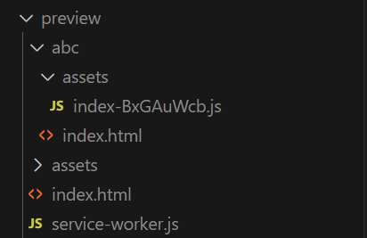
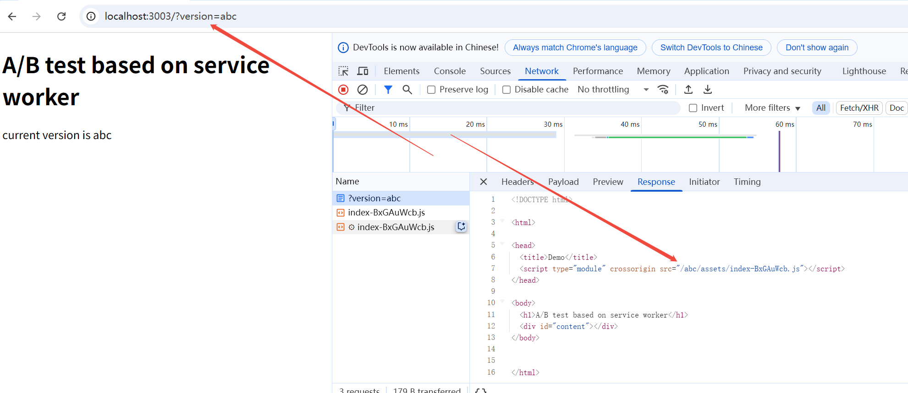

# 通过 Service Worker 实现 Html proxy

在常规的 SPA 应用中(通常由一个 html 文件入口指定各类静态资源的引用), 通过 Service Worker 改写 html 入口文件可以通过将 html 入口转发实现纯前端的资源代理, 这可以实现:

1. A/B test? 可以根据一些字段(url query, cookie)来进行用户灰度测试
2. 测试环境多版本同路径复用, 如同一个路径不同 feature 的测试

通过 build 命令, 构建出两个版本的 SPA 应用代码。

## Demo

```sh
pnpm i

# this would require input a version string
pnpm build

# 模拟服务端预览
pnpm preview
```

例如, 输入 `abc` 和 不输版本, 会在预览目录创建默认版本和 `abc` 版本:



在预览模式下, 输入两个 url (这里做区分, 是通过浏览器请求 url search 中的 `version` 关键字);



## Reference link

- [Service worker](https://developer.mozilla.org/zh-CN/docs/Web/API/Service_Worker_API)
  - [Life Cycle - important!](https://web.dev/articles/service-worker-lifecycle)
- [Vite pwa](https://vite-pwa-org.netlify.app/)
- [WorkBox](https://developer.chrome.google.cn/docs/workbox/what-is-workbox)
